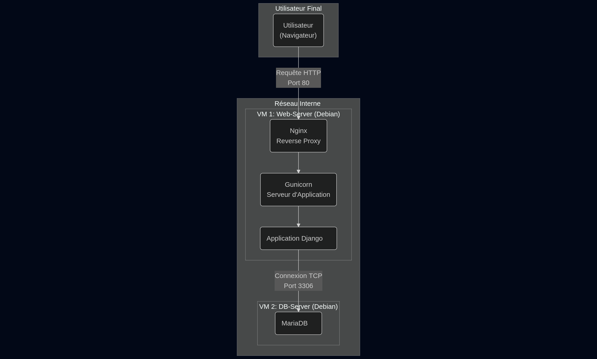
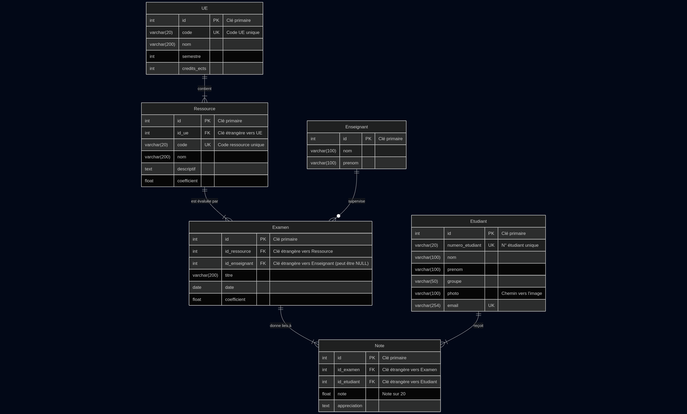

# Gestionnaire de Notes - BUT

[](https://opensource.org/licenses/MIT)
[](https://www.python.org/downloads/)
[](https://www.djangoproject.com/)

Ce projet est une application web développée avec Django pour la gestion complète des notes des étudiants de Bachelor Universitaire de Technologie (BUT). Il fournit une interface centralisée pour administrer les étudiants, les matières, les examens et les résultats, tout en offrant des fonctionnalités d'analyse et de reporting.

## 🎯 But du projet

L'objectif principal est de fournir un outil robuste et intuitif pour :
-   **Centraliser** les informations relatives à la scolarité des étudiants.
-   **Simplifier** la saisie et la gestion des notes pour les enseignants.
-   **Automatiser** le calcul des moyennes pondérées et des classements.
-   **Générer** des relevés de notes officiels et propres au format PDF.

## ✨ Fonctionnalités

-   **Gestion complète (CRUD)** des entités suivantes :
    -   Étudiants (avec photo)
    -   Unités d'Enseignement (UE)
    -   Ressources (matières associées à une UE)
    -   Enseignants
    -   Examens
    -   Notes
-   **Calculs automatiques et pondérés** :
    -   Moyenne par ressource (en fonction des coefficients des examens).
    -   Moyenne par UE (en fonction des coefficients des ressources).
    -   Moyenne générale (en fonction des crédits ECTS des UE).
-   **Classements dynamiques** pour chaque ressource, chaque UE et au niveau général.
-   **Saisie de notes efficace** :
    -   Manuellement via un formulaire.
    -   En masse via l'**import d'un fichier CSV**, avec un rapport détaillé des succès et erreurs.
-   **Génération de PDF** :
    -   Création d'un relevé de notes complet et daté pour chaque étudiant.
    -   Le PDF est généré à partir d'un template HTML/CSS pour une personnalisation totale.
-   **Interface visuelle claire** :
    -   Design sobre et moderne réalisé en HTML/CSS pur (sans librairie comme Bootstrap).
    -   Codes couleur (rouge, orange, vert) pour une lecture rapide des résultats.

## 🛠️ Stack Technique

Ce projet est construit avec les technologies suivantes :
-   **Backend** : Python 3
-   **Framework Web** : Django
-   **Gestion des images** : Pillow
-   **Génération de PDF** : WeasyPrint
-   **Base de données** : SQLite (par défaut en développement)

## 🚀 Installation et Déploiement

Suivez ces étapes pour lancer le projet sur votre machine locale.

### Prérequis
-   Git
-   Python 3.10 ou supérieur
-   `pip` et `venv`
-   Dépendances système pour WeasyPrint

### 1. Cloner le dépôt
```bash
git clone https://github.com/cyprienbf/GestionNotes.git
cd GestionNotes
```

### 2. Configurer l'environnement virtuel
```bash
# Créer l'environnement
python3 -m venv venv

# Activer l'environnement
# Sur Linux/macOS
source venv/bin/activate
# Sur Windows
# venv\Scripts\activate
```

### 3. Installer les dépendances
```bash
# Installer les librairies Python
pip install -r requirements.txt
```

### 4. Configurer la base de données
```bash
# Appliquer les migrations pour créer les tables de la base de données
python manage.py migrate

# Créer un superutilisateur pour accéder à l'interface d'administration (si besoin)
python manage.py createsuperuser
```
*(Suivez les instructions pour créer votre compte administrateur)*

### 5. Lancer le serveur de développement
```bash
python manage.py runserver
```
L'application est maintenant accessible à l'adresse **http://127.0.0.1:8000/**.

🏗️ Architecture et Déploiement en Production

Pour un déploiement robuste, le projet est conçu pour être hébergé sur une architecture à deux machines virtuelles (VMs) : une pour l'application web et une pour la base de données. Cette séparation améliore la sécurité et les performances.
Schéma de l'Architecture



Déploiement Automatisé avec les Scripts

Des scripts shell sont fournis pour automatiser entièrement la configuration des deux VMs Debian 12 avec Virt-Manager.

1. Préparation

    Assurez-vous d'avoir Virt-Manager installé.

    Créez deux VMs Debian 12 vierges et connectez-les à un même réseau virtuel (ex: 192.168.100.0/24).

2. Configuration du Serveur de Base de Données

    Objectif : Installer et configurer MariaDB pour n'accepter que les connexions de la VM Web.

    Actions :

        Copiez le dossier db_server_setup (contenant setup_db.sh et le dossier config_files) sur la VM de la base de données.

        Modifiez les variables (IPs, mots de passe) au début du script setup_db.sh.

        Rendez le script exécutable : chmod +x setup_db.sh.

        Exécutez-le en tant que root : sudo ./setup_db.sh.

    Le script s'occupe de tout : installation, copie des configurations, création de la base de données et configuration du pare-feu.

3. Configuration du Serveur Web

    Objectif : Installer Nginx, Gunicorn et le projet Django. Nginx servira de reverse proxy pour Gunicorn, qui exécute l'application.

    Actions :

        Copiez le dossier web_server_setup (contenant setup_web.sh et ses config_files) sur la VM web.

        Modifiez les variables (IPs, mots de passe, URL du dépôt Git, etc.) au début du script setup_web.sh.

        Rendez le script exécutable : chmod +x setup_web.sh.

        Exécutez-le en tant que root : sudo ./setup_web.sh.

    Le script clone le projet, installe les dépendances, configure Django pour la production, met en place les services gunicorn et nginx, et configure le pare-feu.

Une fois les deux scripts exécutés, l'application sera accessible à l'adresse IP de la VM Web.

🗃️ Modèle de Données

Le schéma ci-dessous représente les relations entre les différentes entités de la base de données (Étudiants, UE, Examens, Notes, etc.).



## 📁 Structure du projet

Le projet est organisé en plusieurs applications Django, chacune ayant une responsabilité unique :

-   `gestion_notes/` : Fichiers de configuration du projet (settings, urls globales).
-   `etudiants/` : Gestion du CRUD et de la logique métier des étudiants.
-   `ues/` : Gestion du CRUD des Unités d'Enseignement.
-   `ressources/` : Gestion du CRUD des ressources (matières).
-   `enseignants/` : Gestion du CRUD des enseignants.
-   `examens/` : Gestion du CRUD des examens et de la saisie de notes par CSV.
-   `notes/` : Gestion du CRUD des notes individuelles.
-   `static/` : Contient les fichiers CSS, images et le logo.
-   `templates/` : Contient les templates HTML globaux (`base.html`, `home.html`) et les sous-dossiers de chaque application.
-   `media/` : Dossier où sont stockées les photos des étudiants uploadées.

## 🔮 Améliorations futures (To-Do)

-   [ ] **Système d'authentification complet** : Mettre en place la connexion pour les enseignants et les étudiants.
-   [ ] **Portails dédiés** :
    -   Un **portail Enseignant** avec des droits étendus (création de contenu, saisie de notes).
    -   Un **portail Étudiant** en lecture seule où l'étudiant ne peut voir que ses propres résultats.
-   [ ] **Tableau de bord** : Créer une page d'accueil après connexion avec des statistiques (moyenne de la promotion, prochains examens, etc.).

## 📄 Licence

Ce projet est distribué sous la **licence MIT**. Voir le fichier `LICENSE` pour plus de détails.
